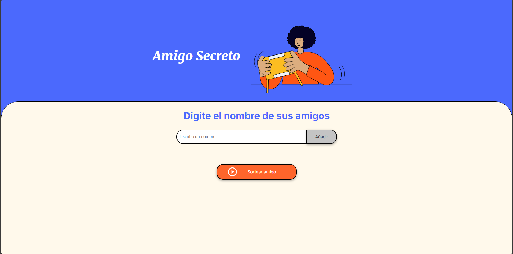
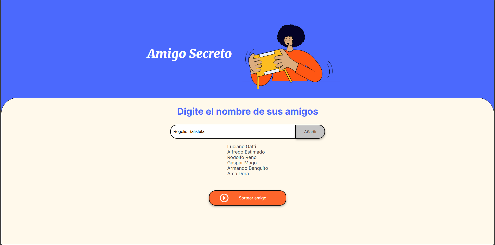
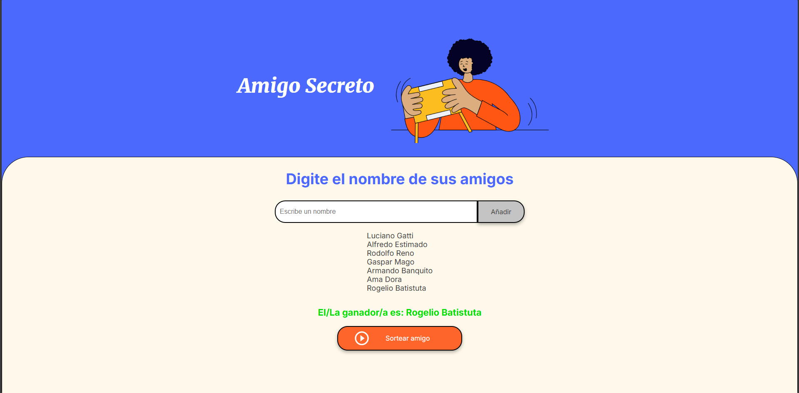

# 🎉 Sorteo de Amigos

Este proyecto permite a los usuarios agregar nombres a una lista y realizar un sorteo aleatorio para seleccionar un amigo.

## 🚀 Funcionalidades

- **Agregar nombres:** Los usuarios pueden escribir el nombre de un amigo en un campo de texto y agregarlo a una lista visible al hacer clic en "Adicionar".
- **Validar entrada:** Si el campo de texto está vacío, el programa mostrará una alerta pidiendo un nombre válido.
- **Visualizar la lista:** Los nombres ingresados aparecerán en una lista debajo del campo de entrada.
- **Sorteo aleatorio:** Al hacer clic en el botón "Sortear Amigo", se seleccionará aleatoriamente un nombre de la lista y se mostrará en la página.

## 📌 Requisitos

- Un navegador web moderno.
- No se requiere instalación de software adicional.

## 📂 Estructura del Proyecto

```
📦 TuRepositorio
├── 📂 assets       # Carpeta de imágenes y otros recursos         
├── 📄 index.html   # Estructura de la aplicación
├── 📄 style.css    # Estilos de la aplicación
├── 📄 app.js       # Lógica del programa
```

## 🎯 Cómo Usarlo

1. Ingresa un nombre en el campo de texto.
2. Haz clic en el botón "Adicionar" para agregarlo a la lista.
3. Repite el proceso para agregar más nombres.
4. Haz clic en "Sortear Amigo" para seleccionar un nombre al azar.

## 📸 Capturas de Pantalla

### 📌 Página de inicio


### 📌 Listado de amigos cargados


### 📌 Resultado del sorteo


## 📜 Licencia

Este proyecto está bajo la licencia MIT. ¡Siéntete libre de contribuir y mejorarlo! 😊
